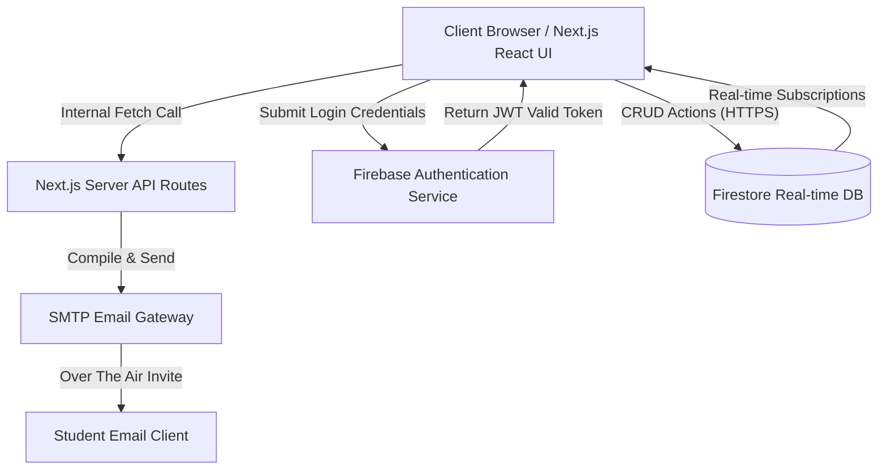
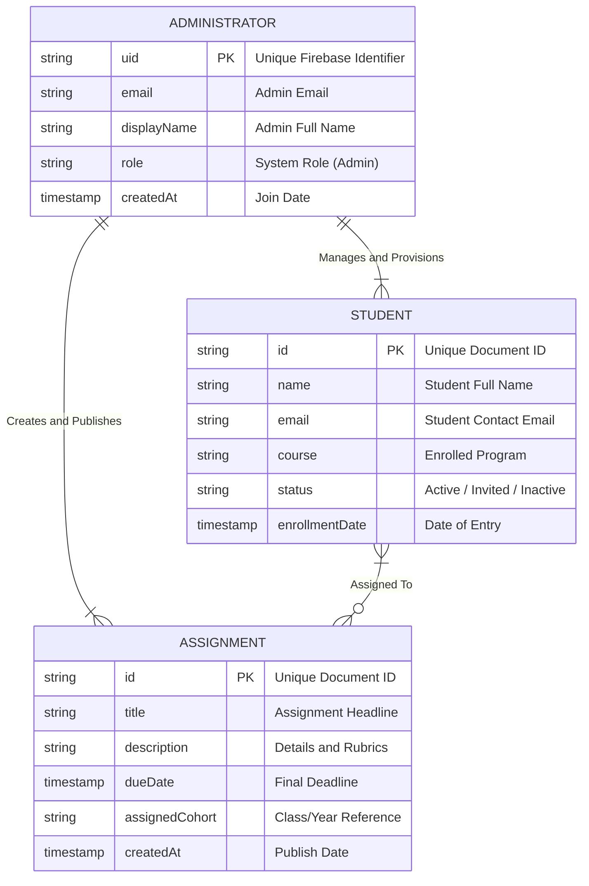
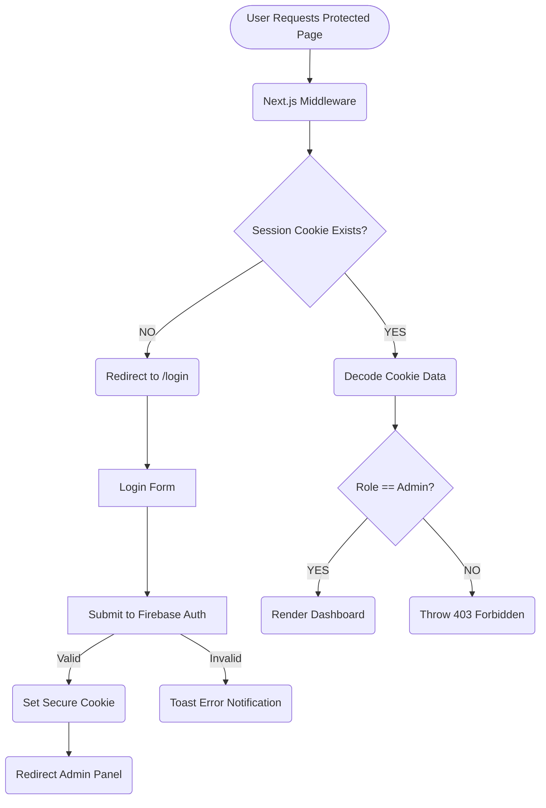
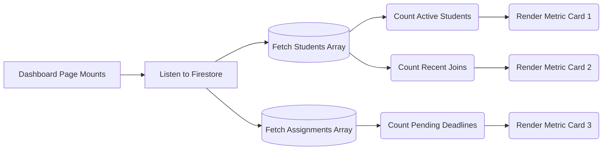
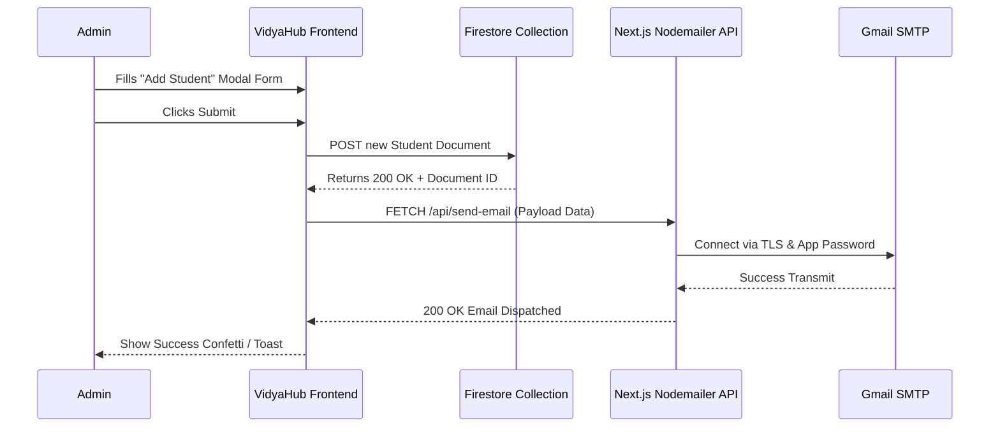
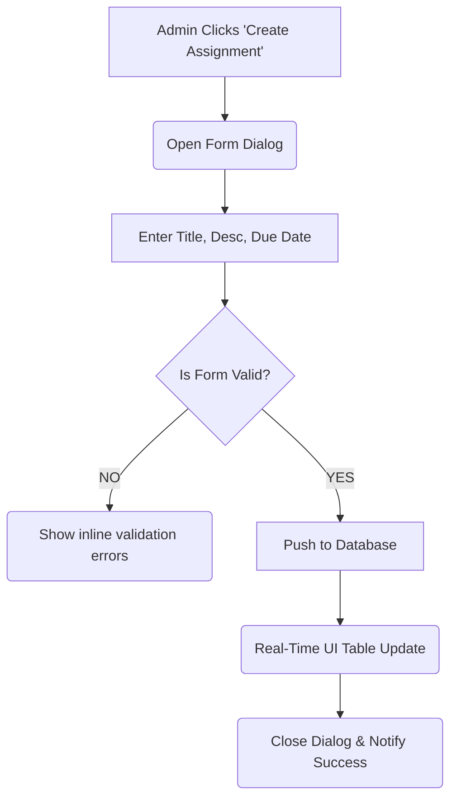

# COMPLETE PROJECT DOCUMENTATION: VIDYAHUB
### Educational Management Platform

**Submitted for Academic Fulfillment**
**Date:** [Insert Date]  
**Submitted By:** [Insert Names]  

---
\pagebreak

## TABLE OF CONTENTS

1. [Abstract](#1-abstract)
2. [Introduction & Problem Statement](#2-introduction--problem-statement)
3. [System Feasibility & Requirements](#3-system-feasibility--requirements)
4. [System Architecture](#4-system-architecture)
5. [Database Design & ER Diagram](#5-database-design--er-diagram)
6. [Detailed Module Design & Flowcharts](#6-detailed-module-design--flowcharts)
    - [6.1 Authentication & Security Module](#61-authentication--security-module)
    - [6.2 Dashboard & Analytics Module](#62-dashboard--analytics-module)
    - [6.3 Student Management & Automation Module](#63-student-management--automation-module)
    - [6.4 Assignment Management Module](#64-assignment-management-module)
7. [System Implementation & Technology Stack](#7-system-implementation--technology-stack)
8. [Software Testing](#8-software-testing)
9. [Project Screenshots](#9-project-screenshots)
10. [Conclusion & Future Scope](#10-conclusion--future-scope)

---
\pagebreak

## 1. ABSTRACT

In the contemporary educational sector, the need for an efficient administrative management system is indispensable. **VidyaHub** is a comprehensive Educational Management Platform developed to digitize, streamline, and centralize academic operations. The primary objective of VidyaHub is to mitigate the inefficiencies found in traditional legacy systems—such as scattered data, manual communication pipelines, and cumbersome record tracking.

Built entirely on modern decoupled architectures utilizing Next.js, Firebase, and Tailwind CSS, the platform acts as an administrative nervous system. It enables institutions to manage student lifecycles, assign academic tasks dynamically, securely authenticate administrative personnel, and automate standard procedures like onboarding emails. Through real-time data synchronization and an emphasis on user experience (UI/UX), VidyaHub proves that an intuitive interface and serverless infrastructure can significantly reduce operational overhead and human error in institutional administration. 

---

## 2. INTRODUCTION & PROBLEM STATEMENT

### 2.1 Context and Motivation
Managing essential institutional data typically involves navigating a multitude of physical spreadsheets, fragmented databases, and disparate communication tools (like standard email clients or messaging apps). This decentralized strategy is not only labor-intensive but deeply vulnerable to data inconsistency. 

### 2.2 Drawbacks of the Existing System
1. **Data Silhouette:** With no singular data source, extracting statistics regarding student attendance, current workloads, or pending assignments takes considerable time.
2. **Manual Onboarding:** Admins must manually draft invitations, distribute credentials, and maintain mailing lists for every newly enrolled student cohort.
3. **Security Vulnerabilities:** Traditional local systems lack modern token-based authentication and Role-Based Access Controls (RBAC).
4. **Platform Inaccessibility:** Older systems are often unoptimized for mobile or remote administrative work.

### 2.3 Proposed Solution: VidyaHub
VidyaHub transforms the administrative landscape into a localized Cloud System. It automates onboarding via an SMTP email API when a student is provisioned. It tracks system-wide tasks and represents complex database queries smoothly on an interactive dashboard dashboard—creating a centralized command center for administrators.

---

## 3. SYSTEM FEASIBILITY & REQUIREMENTS

### 3.1 Technical Feasibility
The platform runs heavily on a Serverless Backend-as-a-Service (BaaS) via Firebase. Thus, local server architecture or continuous server-maintenance overhead is completely sidestepped. By executing API calls through Next.js server actions, security and high concurrency are guaranteed.

### 3.2 Software Requirements
- **Frontend Framework:** Next.js 14 (React)
- **Styling:** Tailwind CSS, shadcn/ui components
- **Database:** Firebase Firestore (Cloud NoSQL DB)
- **Authentication System:** Firebase Auth API
- **Email Server Node:** Nodemailer (SMTP Gateway via Gmail)

### 3.3 Hardware Requirements (Client-Side)
- **Processor:** Any modern dual-core mobile or desktop CPU.
- **RAM:** Minimum 2GB allocated for active browser processing.
- **Browser:** Evergreen versions of Chrome, Edge, Safari, or Firefox.
- **Internet:** Standard stable broadband connection.

---

## 4. SYSTEM ARCHITECTURE

VidyaHub is structured across a Modern Cloud Architecture, operating under a Client-Server paradigm with direct DB hooks. 

---
\pagebreak

## 5. DATABASE DESIGN & ER DIAGRAM

Firebase Firestore is a NoSQL, Document-Based database. Therefore, data is stored in structural Collections mapped to Documents, avoiding heavy relational joins.

---
\pagebreak

## 6. DETAILED MODULE DESIGN & FLOWCHARTS

### 6.1 Authentication & Security Module
This module handles all session state and access control. Admin panels are strictly cordoned off behind Next.js Middleware which constantly verifies the presence of active Firebase securely encrypted cookies/tokens.

### 6.2 Dashboard & Analytics Module
The landing area immediately following successful authentication. This module aggregates raw database data into human-readable metrics.

### 6.3 Student Management & Automation Module
This module operates two essential workflows: 1) The visual Data Grid that displays, filters, and edits all known students. 2) The SMTP Email integration that triggers when a new student is established on the database.

### 6.4 Assignment Management Module
Used to curate coursework. Features full text input, deadline selections, and categorization parameters. Real-time updates ensure that when a new assignment is submitted, the dashboard tables update uniformly without a page refresh.

---
\pagebreak

## 7. SYSTEM IMPLEMENTATION & TECHNOLOGY STACK

1. **Next.js 14:** Utilized purely for its Server-Side Rendering (SSR) to speed up initial load times securely, hiding business logic out of the browser context. 
2. **React Hooks & State:** Extensively using React standards (`useState`, `useEffect`) alongside custom hooks for reading the database dynamically. 
3. **shadcn/ui & Tailwind:** shadcn supplies purely accessible and well-documented components. Tailwind acts as the styling engine, writing inline CSS natively avoiding bloated global CSS files.
4. **Nodemailer Library:** Operating purely on Node-side. Extracts student variables and embeds them directly into an HTML template containing their sign-up link. 

---

## 8. SOFTWARE TESTING

Various testing methodologies were applied across the architecture to ensure integrity:
1. **Unit Testing:** Specific API behaviors, such as ensuring empty strings aren't accepted in form inputs, verifying email formats (`regex`), and ensuring that the Firebase write schema maps exactly to our TypeScript interfaces.
2. **Integration Testing:** Ensuring the Next.js API route communicates seamlessly with the Gmail SMTP server and does not crash the client UI if external internet failure occurs.
3. **Authentication Boundary Testing:** Manually attempting to navigate directly to `/admin/dashboard` as an unauthenticated guest to ensure the middleware successfully interdicts the connection and redirects.

---
\pagebreak

## 9. PROJECT SCREENSHOTS

*(Insert images representing the system interfaces below)*

**1. Authentication Gateway**

*Description: Secure admin login gateway attached to Firebase Authentication.*

**2. Main System Dashboard**

*Description: Displays overall system health, current statistics, and aggregated assignment counts.*

**3. Student Directory**

*Description: The central hub to view, filter, edit, or delete registered student accounts in the institution.*

**4. Adding Students & Email Trigger**

*Description: The modal allowing institutions to input student details and trigger the automated onboarding SMTP protocol.*

---

## 10. CONCLUSION & FUTURE SCOPE

### 10.1 Conclusion
VidyaHub successfully resolves modern organizational issues prevalent within educational administrative environments. Through the implementation of a Serverless database and Next.js, VidyaHub minimizes latency, significantly improves visual layouts, and reliably handles core administrative duties. By replacing repetitive manual work (e.g., student onboarding and manual table tracking) with automated processes, administrators can redirect their focus toward academic enrichment rather than administrative overhead.

### 10.2 Future Enhancements
- **Student Facing Frontend (PWA):** Building out a Progressive Web Application where students can log in independently using the mailed links to submit assignments locally.
- **Automated Grading Scripts:** Implementing specific rubric checking scripts to verify basic criteria on student submissions.
- **Multi-tenant Role Hierarchy:** Dividing administrative roles into super-admins (Principal/Dean) and standard admins (Teachers). 
- **Bulk Import/Export via CSV/Excel:** Allowing the institution to quickly upload a mass spreadsheet of 500+ students instantly populating the database.

---
**-- END OF DOCUMENT --**
