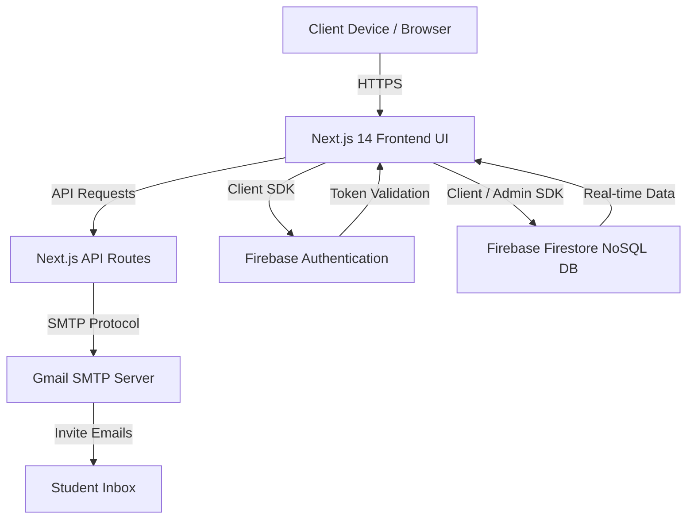
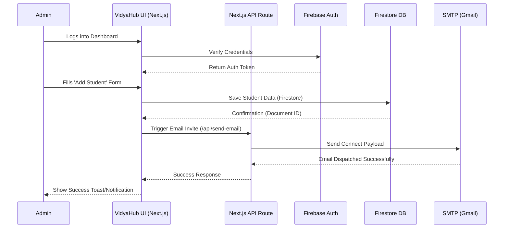
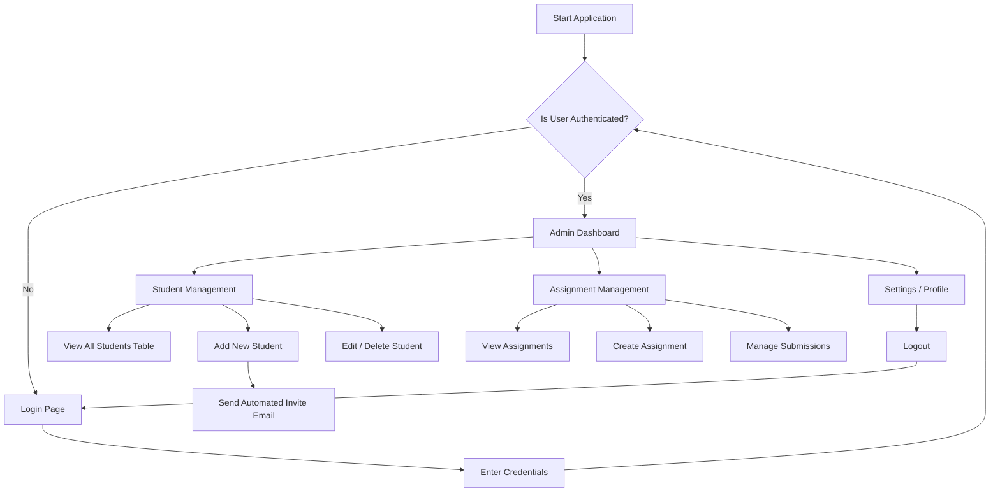
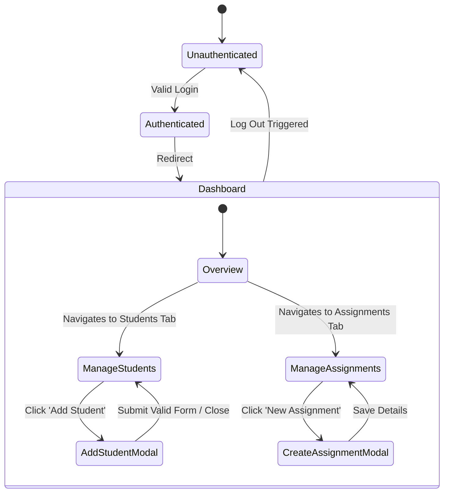

# VIDYAHUB: EDUCATIONAL MANAGEMENT PLATFORM
*Comprehensive Academic Project Documentation*

---

## 1. ABSTRACT

The rapid evolution of technology in the educational sector has created a pressing need for efficient, scalable, and secure platforms to manage academic activities. **VidyaHub** is an advanced Educational Management Platform developed to streamline administrative workflows, enhance communication, and digitize student and assignment management. Built on a modern technology stack encompassing Next.js 14, Tailwind CSS, shadcn/ui, and Firebase, the system offers a robust Admin Dashboard that serves as the central nervous system for educational institutions. 

The platform facilitates the seamless addition and management of student records, sophisticated assignment tracking, and automated email invitations via SMTP integration. By migrating from traditional paper-based or fragmented digital systems to a unified cloud-based architecture, VidyaHub eliminates data redundancy, improves accessibility, and ensures high-level security through Firebase Authentication and Firestore data rules. The result is a highly responsive, user-friendly ecosystem that empowers administrators to oversee educational operations with unprecedented efficiency, ultimately fostering a more organized and productive academic environment.

---

## 2. BASE PAPER / RESEARCH DOMAIN

### 2.1 Contextualization
The digital transformation of educational management systems has been a focal point of recent academic research in software engineering and information systems. Traditional Educational Management Systems (EMS) often suffer from siloed data architecture, poor user interfaces, and a lack of real-time communication capabilities. Recent literature emphasizes the necessity of Transitioning to Cloud-Integrated Web Services (TCIWS) for educational administration, citing improvements in data integrity, operational speed, and stakeholder engagement.

### 2.2 Problem Statement in Current Literature
Research indicates that existing monolithic architectures in educational institutions are rigid and costly to maintain. Literature highlights a significant gap in platforms that combine aesthetic (UI/UX) modernism with lightweight backend services (like Serverless Functions or Firebase). VidyaHub aligns with the principles of Next-Generation Web Architectures by utilizing Server-Side Rendering (SSR) and React Server Components (RSC) provided by Next.js 14, thereby reducing client-side load and improving Search Engine Optimization (SEO) and Initial Page Load (IPL) metrics.

### 2.3 Proposed Solution in Context of Research
VidyaHub serves as a practical implementation of a Micro-Services-Oriented Architecture (MSOA) where authentication (Firebase Auth), database operations (Firestore), and communication (SMTP) are decoupled yet seamlessly integrated. This project validates the hypothesis that leveraging a managed Backend-as-a-Service (BaaS) alongside a powerful React framework significantly reduces development cycles while providing enterprise-grade scalability and security.

---

## 3. INTRODUCTION

### 3.1 Overview
In the contemporary academic landscape, managing student data, orchestrating assignments, and maintaining clear lines of communication are critical tasks that demand precision and reliability. **VidyaHub** is designed as a turnkey solution to these administrative challenges. It is a comprehensive web-based application tailored for educational administrators, providing them with a secure, centralized dashboard to efficiently govern academic processes.

### 3.2 Objectives
*   **Centralization:** To consolidate student records, assignments, and administrative metrics into a single, easily navigable dashboard.
*   **Automation:** To automate routine tasks, particularly the onboarding of new students through automated email invitations.
*   **Security:** To employ robust authentication mechanisms ensuring that sensitive educational data is protected against unauthorized access.
*   **Usability:** To deliver a state-of-the-art user interface using Tailwind CSS and shadcn/ui that ensures a seamless experience across all devices (desktops, tablets, and smartphones).
*   **Scalability:** To utilize cloud infrastructure (Firebase) that can scale dynamically as the institution's user base grows.

### 3.3 Scope of the Project
The current scope encompasses the Admin portal, which includes user authentication, real-time analytics on the dashboard, comprehensive CRUD (Create, Read, Update, Delete) operations for students and assignments, and an automated email notification system. Future scopes will include dedicated Student and Teacher portals.

---

## 4. EXISTING SYSTEM

### 4.1 Description of the Current Environment
Many educational institutions still rely on a hybrid of outdated legacy software, physical spreadsheets, and disparate communication tools (like disjointed email threads or instant messaging groups). In these existing systems, data is often duplicated across different departments, leading to inconsistencies.

### 4.2 Drawbacks of the Existing System
*   **Data Fragmentation:** Student information is scattered across various files and formats, making data retrieval time-consuming and error-prone.
*   **Manual Onboarding:** Administrators must manually create accounts and send out individual emails to students, which is wildly labor-intensive.
*   **Poor User Experience:** Legacy systems often feature archaic interfaces that are not responsive on mobile devices and have a steep learning curve.
*   **Security Vulnerabilities:** Storing data on local hard drives or rudimentary databases exposes the institution to data loss and unauthorized access.
*   **Lack of Real-time Insights:** Administrators do not have immediate access to overall statistics, such as total student counts or pending assignments, hindering proactive decision-making.

---

## 5. PROPOSED SYSTEM

### 5.1 System Overview
The proposed system, **VidyaHub**, directly addresses the shortcomings of the existing state by introducing a unified, cloud-hosted platform. It brings all administrative tasks under one digital roof with a modern, highly intuitive interface.

### 5.2 Key Features and Solutions
*   **Cloud-Based Storage:** By leveraging Firebase Firestore, all student and assignment data is stored in a secure, NoSQL cloud database, ensuring real-time synchronization and eliminating data loss.
*   **Automated Communication:** The integration of an SMTP email system automates the delivery of personalized invite links to students upon registration.
*   **Intuitive Dashboard:** A central Admin Dashboard provides instant, at-a-glance metrics (e.g., total students, total assignments) using responsive widgets and charts.
*   **Role-Based Security:** Firebase Authentication ensures that only verified administrators can access the dashboard and modify institutional data.
*   **Responsive Design:** The UI, heavily driven by Tailwind CSS and shadcn/ui components, guarantees that the platform is fully accessible and visually appealing on any screen size.

---

## 6. SYSTEM ARCHITECTURE & DIAGRAMS

### 6.1 System Architecture
The architecture follows a modern serverless model. The frontend is built on Next.js 14, acting as both the client and the API gateway (via Next.js API Routes). External BaaS (Backend as a Service) providers handle database and authentication.

### 6.2 VidyaHub Architecture Workflow
The workflow below illustrates the step-by-step data flow when an administrator adds a new student to the system.

### 6.3 System Flow Diagram
This flowchart demonstrates the overall navigational flow within the VidyaHub application for an Administrator.

---

## 7. MODULES DESCRIPTION

VidyaHub is logically divided into several interconnected modules.

### 7.1 Admin Authentication Module
This module acts as the gatekeeper for the platform. Utilizing Firebase Authentication, it allows administrators to securely log in. It manages session cookies, token refreshes, and route protection via Next.js middleware, ensuring that unauthorized users are immediately redirected to the secure login screen.

### 7.2 Dashboard and Analytics Module
The core landing page post-login. It comprises analytical cards and summary tables. Built using shadcn/ui components, it provides a high-level overview of system metrics (e.g., active students, pending assignments, recent system activity) and provides quick-action buttons for common administrative tasks.

### 7.3 Student Management Module
This module handles the complete lifecycle of a student entity within the admin scope. 
*   **Data Entry Form:** Captures details like Name, Email, Enrollment Number, and Course.
*   **Data Grid/Table:** Displays the list of all students with advanced filtering, pagination, and sorting capabilities.
*   **CRUD Operations:** Allows the admin to edit details, manage enrollment status, or remove students from the database.

### 7.4 Assignment Management Module
Dedicated to handling academic workloads. Over here, the admin can create new assignments, define strict deadlines, attach detailed descriptions, and assign them to specific cohorts. The module ensures real-time updates to the dashboard statistics as new assignments are published.

### 7.5 Communication & Email System Module
A critical automation module backend by Next.js API routes and the `nodemailer` library. When a new student is added, this module securely connects to the Gmail SMTP server using an App Password. It constructs an HTML-formatted email containing an invite link and system introduction, dispatching it instantly to the student's email address.

### 7.6 Admin Panel Workflow
The internal state transition of the Admin Panel illustrates how the Administrator navigates the system.

---

## 8. DATABASE STRUCTURE

VidyaHub utilizes **Firebase Firestore**, a flexible, highly scalable NoSQL cloud database. Data is organized into structured collections and corresponding documents.

### 8.1 Users Collection (Admins)
*   `uid` (String): Unique identifier provided by Firebase Auth.
*   `email` (String): Admin's email address.
*   `displayName` (String): Full name of the administrator.
*   `role` (String): Defined strictly as "Admin" for backend authorization rules.
*   `createdAt` (Timestamp): Account creation date and time.

### 8.2 Students Collection
Stores centralized records of all enrolled students.
*   `id` (String): Auto-generated unique Firestore document ID.
*   `name` (String): Student's full name.
*   `email` (String): Student's email address (must be unique).
*   `course` (String): Registered course or major.
*   `enrollmentDate` (Timestamp): Date of system entry.
*   `status` (String): Allowed values e.g., "Active", "Pending Invite", "Inactive".

### 8.3 Assignments Collection
Keeps track of academic tasks and workloads.
*   `id` (String): Auto-generated unique Firestore document ID.
*   `title` (String): Title of the assignment.
*   `description` (Text): Detailed instructions and grading rubrics.
*   `dueDate` (Timestamp): Final submission deadline.
*   `assignedCohort` (Array/String): Specific class or student group references.
*   `createdAt` (Timestamp): Creation timestamp logging.

---

## 9. TECHNOLOGY STACK EXPLANATION

### 9.1 Frontend & Core Framework: Next.js 14
Next.js is the chosen React framework. Version 14 introduces the highly anticipated App Router and React Server Components, allowing VidyaHub to achieve exceptional performance. Next.js handles routing, server-side rendering, and provides backend API routes out-of-the-box, making it an incredibly powerful full-stack framework.

### 9.2 Styling & UI: Tailwind CSS + shadcn/ui
**Tailwind CSS** is a utility-first CSS framework that allows for rapid UI development directly within JSX classes. This ensures a highly responsive and custom aesthetic without bloated, unmaintainable CSS files. 
**shadcn/ui** is a collection of brilliantly designed, re-usable, and accessible (a11y) components built on top of Radix UI and Tailwind. It ensures the application retains a premium, consistent design language across complex components like forms, modals, dialogs, and data tables.

### 9.3 Database & Authentication: Firebase
*   **Firebase Firestore:** A NoSQL document-based database that provides powerful real-time listeners. It was chosen for its schema flexibility, allowing rapid iterational development and seamless Next.js App Router integration.
*   **Firebase Authentication:** Handles secure user login without the overhead of building custom JWT (JSON Web Token) management systems from scratch. It secures the platform against unauthorized access via robust backend validation.

### 9.4 Email System: SMTP / Gmail App Password
For the automated email system, VidyaHub integrates **Nodemailer** within Next.js backend API routes. By utilizing Gmail's reliable SMTP servers and an App-Specific Password, the system securely bypasses standard 2FA bottlenecks to programmatically send high-deliverability email invitations to users.

---

## 10. ADVANTAGES

1.  **High Performance & SEO:** Utilizing Next.js Server Components ensures the application loads rapidly, offering a smooth user experience while being friendly to web crawlers.
2.  **Centralized Control Data:** Eliminates paper trails and scattered spreadsheets; everything is securely accessible via one intuitive dashboard.
3.  **Time Efficiency & Automation:** Automated email invites via SMTP save administrators countless hours of manual data entry and communication overhead.
4.  **Real-time Synchronization:** Firestore's real-time capabilities mean the UI is always up-to-date without needing manual page refreshes. Data mutations are instantly reflected.
5.  **Premium User Experience:** The combination of Tailwind CSS and shadcn/ui provides a polished, desktop-class software experience directly within a web browser, prioritizing both aesthetics and accessibility.
6.  **Cost-Effective Scalability:** The serverless architecture and Firebase's generous tiers mean the application is incredibly cost-efficient to host and maintain, scaling automatically as traffic increases.

---

## 11. FUTURE ENHANCEMENTS

While the current iteration of VidyaHub establishes a robust administrative core, future versions aim to expand its ecosystem considerably:

1.  **Dedicated Student Portal:** A specialized frontend interface where students can log in, view their upcoming assignments, download resources, and submit project files.
2.  **Teacher/Faculty Role Portal:** Role-based access exclusively for teachers to securely grade assignments, upload course material, and communicate with specific class modules.
3.  **Advanced AI Analytics:** Integration of Machine Learning models to predict student performance trends and highlight at-risk students needing attention based on engagement metrics.
4.  **Push Notification System:** Implementing Progressive Web App (PWA) Service Workers for browser-based push notifications regarding impending deadlines or emergency announcements.
5.  **Payment Gateway Integration:** Secure integration with Stripe or Razorpay to handle academic fee collection and automated receipt generation directly through the platform.

---

## 12. CONCLUSION

In conclusion, **VidyaHub** represents a significant leap forward from traditional, fragmented educational management techniques. By unifying student data tracking, assignment distribution, and automated administrative communication into one sleek, cloud-powered dashboard, the platform drastically reduces organizational overhead and human error. 

The rigorous application of modern web technologies—specifically Next.js 14, Tailwind CSS, shadcn/ui, and Firebase—ensures that the system is not only robust and highly scalable but also provides an exemplary, modern user experience. As educational institutions continue to embrace digital transformation, VidyaHub stands out as a foundational, enterprise-ready tool capable of adapting to future academic requirements, definitively proving the viability, speed, and immense power of modern serverless web applications within the education sector.
